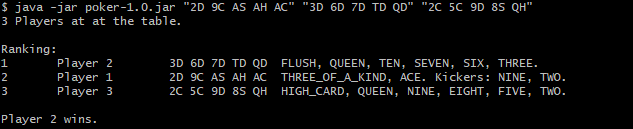
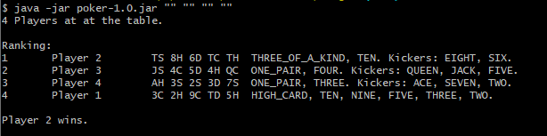
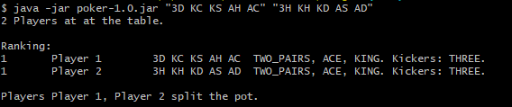

# PokerSimulator
A simple poker simulator. It is able to analyze hands of cards and determine the winners of a game. The "game" consists purely of dealing the hands and comparing them, actual gambling is not involved yet.

# Usage
Call the jar with poker hands as arguments, whereas each card is represented as a two - character - String of value and suit.  
Valid inputs for value are: { 2, 3, 4, 5, 6, 7, 8, 9, 10, J, Q, K, A } representing the values from two to ace in the French Deck.  
Valid inputs for suit are: { C, D, H, S } representing Clubs, Diamonds, Hearts, and Spades.  

Cards are separated with a space. Each String represents a hand of five cards.
The software analyzes the hand and prints the winner(s). It follows the poker rules as the game is decided by the ranking of the hand. Tie breakers are the rank cards, then the kicker cards.

Consider for example this hand:
3D KC KS AH AC

It holds two pairs, of aces and one of kings, thus the rank is TWO_PAIRS.

The pairs are formed by aces and kings, thus the two rank cards are ACE and KING, in that order. If another player happened to hold a pair of aces and a pair of Jacks, this hand would still win.

The remaining cards after the rank was formed are to so-called kicker cards, in this case the three of Diamonds. In the very unlikely scenario that another player happened to hold the other two aces and kings, the kicker card decides the winner. If this other player holds anything above a three, they win. If they also hold a three, the pot is split among the two players. You can find an according example below.

## Valid inputs
All players use the same deck, so each card must only occur once.
A hand cannot exceed five cards.
The deck is shuffled at the start of the game. A hand that hold less than five cards is filled with the next cards from the deck. Be aware that this mechanic does not take any downstream hands into account.
It is thus also possible to just feed the program empty strings for completely randomized games.
A French deck holds 52 cards which naturally limits the amount of five-card-hands to a maximum of ten.

## Examples
**A simple game:**  
*java -jar poker-1.0.jar "2D 9C AS AH AC" "3D 6D 7D TD QD" "2C 5C 9D 8S QH"*

**A random game:**  
*java -jar poker-1.0.jar "" "" "" ""*

**Split pot:**  
*java -jar poker-1.0.jar "3D KC KS AH AC" "3H KH KD AS AD"*

# Structure

This section aims to give a brief overview over the models used in this software.

## Main package

The **PokerTable** is the central point of events. It seats the *Players* and the *Dealer* and provides the space for the game to happen.

The **Player** represents a poker player.  It is a simple data structure to hold the their own name, a *HandOfCards*, and a *PokerHand* once the former is analyzed.

The **Dealer** is the central point of logic in the game. They're in control of the *DeckOfCards* and have access to the necessary Logic and *PokerHandEvaluator* objects to analyze and run the game. It uses each of them in descending order to determine the most valuable hand it can derive from the cards provided.

## Card

A **Card** is the most basic entity, it consists of a value of CardSuit and CardValue. CardSuit and CardValue are fixed as Java Enums.

A **DeckOfCards** holds the 52 cards of the French deck. It supports both drawing a specific card and drawing simply the next. A deck can be shuffled to randomize the order of cards.

**HandOfCards** describes a hand of five cards that a poker player can hold. These objects hold no information about the rank or result of their cards.

## Result

A **Pokerhand** is the result of analyzing a *HandOfCards*. It holds a value of the Enum **PokerHandRanking** to represent its value, i.e. whether it's a Pair, two Pairs, and so on.  
Besides that, the poker hand always holds to card value collections taht represent its *rank cards* and *kicker cards*.

The **GameResult** comes into existence when one compare the **PokerHand**s to one another to determine a winner. This data structure holds the winner if there is one, or the list of players that spilt the pot among them. Furthermore, all players in a game are ranked among each other. This utilizes a sorted map with a *pokerHandComparator*.

### Evaluator

This package contains everything we need to determine what a poker hand is.

**PokerHandEvaluator** is an interface to evaluate Poker Hands.  It receives a hand of cards and returns a poker hands. Its implementations are:

1. **HighCardEvaluator**
2. **PairEvaluatort**
3. **TwoPairsEvaluator**
4. **TripleEvaluator**
5. **StraightEvaluator**
6. **FlushEvaluator**
7. **FullHouseEvaluator**
8. **FourOfKindEvaluator**
9. **StraightFlushEvaluator**
10. **RoyalFlushEvaluator**

Each of these is able to determine whether the cards provided match its intended poker hand. Some use synergy effects:  
- Pairs, triples and fours all use the same logic fixated in the **MultiplesEvaluator** they extend.  
- The **RoyalFlushEvaluator** and the **StraightFlushEvaluator** make direct use of the **FlushEvaluator** and the **StraightEvaluator**.

The **CardCollector** is a utility class we can feed cards and it remembers how many cards of what value it got.

## Error

A collection of customized Exceptions to deliver clear error messages in and around poker.

- **DeckException** with a **DeckExceptionCause** describes double drawn cards and empty decks.
- A **HandExceededException** is thrown when we try to deal a hand more than five cards.
- The **PokerParseException** is concerned with everything around recognizing the game input and calculating the result.

## Util

Utility classes.

- The **PureLogFormatter** is a customized formatter that allows us to print to the console without heads or tails and still circumvent the usage of *System.out*
- **NullSafeComparator** is an interface every other comparator in the software uses. When comparing two objects, it takes care of the null checks and then forwards to the implementation.

# Flow of logic

- The game starts at the **PokerTable** where the **Dealer** and the **Players** come come together.
- The **Dealer** parses the input deals the **Cards** to the **Players**
- Lacking the necessary resources, each **Player** leaves it to the **Dealer** to analyze their **HandOfCards** with the right **PokerHandEvaluators**. This results in each Player being told their **PokerHand**.
- With this information, the **Dealer** is able to sort the **Players** into a **GameResult** and determine the winners of the game.
- This result is printed to the console.
